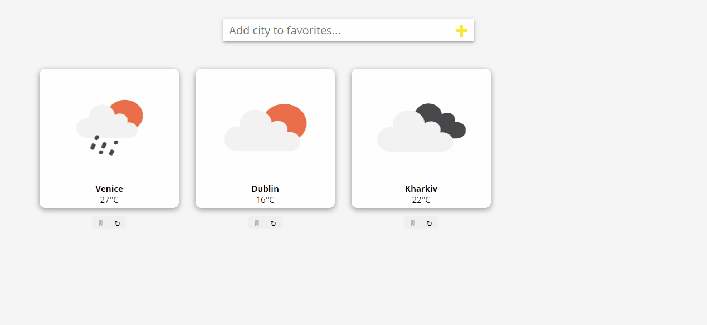

# Weather App 
This is a weather application that allows you to keep track of the weather in your favorite cities.
You can manage this list (add or delete a city), and when you click on the card you can see detailed weather information
#[Demo](https://romandroga-weather-app.netlify.app/)

##Technology used
- React
- React-router
- Redux
- Redux-thunk
- Redux-devtools
- axios
# Get Started

- clone branch `master` with
  `git clone https://github.com/romandroga/react-weather-app.git` or fork it and then
  clone it from your forked repo
- `cd react-weather-app`
- `npm install`
- `npm start`

# License
This project is licensed under the MIT License - see the LICENSE.md file for details

